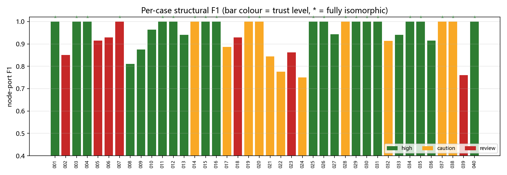
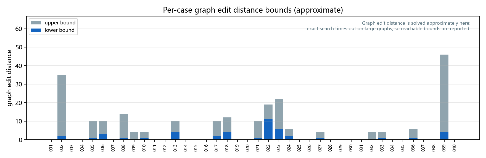

# Schematic Recognition and Netlist Generation

Turn a circuit schematic image into a port-level netlist: YOLOv5 component detection with class
review → morphological wire extraction and skeletonisation → DFS connected-component net
assignment → named-port mapping → standard dictionary netlist → GCN circuit-function
classification.

## Results

Evaluated on 40 public schematics, drawing by drawing against the reference netlists.
Every number below can be reproduced with the scripts in this repository.

| Metric | Result |
|---|---|
| Mean node-port F1 (structural diagnostic, see below) | **0.9451** |
| Fully isomorphic typed-pin graphs | **22 / 40** (strict, polarity kept: 0.9404 / 20) |
| Format validation · component rows · port coverage | **40/40** · 538/540 · 1518/1512 |
| Single-image end-to-end time | **11–13 s** (CPU, no cached labels) |
| Graph edit distance (approximate bounds) | 45 – 230 in total, 22 drawings at 0 |
| Trust level (component/net features only) | high 22 / caution 11 / review 7 |





Per-drawing details are in `output/final/connection_diagnostic.json`,
`output/final/batch_report.json` and `output/final/qa_summary.md`.

**Not included in this repository**: the dataset, the reference netlists, the detector weights and
any rendered figure that contains the source drawings (licensing and size). Put the data in the
layout described below to reproduce every number.

### Metric definitions

- **Node-port F1**: each electrical node is described by the multiset of
  `(component type.port name)` entries attached to it; predicted nodes are paired with reference
  nodes by the Hungarian algorithm, and
  `F1 = 2 × matched ports ÷ (reference ports + predicted ports)`, averaged over the 40 drawings.
  Two-terminal passive devices follow the equivalence rule (interchangeable terminals); the strict
  variant keeps the polarity labels. Net names and component identities are ignored, so this proxy
  is optimistic.
- **Fully isomorphic typed-pin graph**: the whole "component node — port — net" bipartite graph must
  be isomorphic, which is a stricter reading than F1.
- **Graph edit distance**: approximate implementation in `ged_metric.py`. Exact search times out on
  large graphs, so reachable lower/upper bounds are reported; the metric is used for error
  localisation only.

## Data layout

The scripts read from a `data/` directory next to the repository:

```text
data/circuit-dataset/
├── images/             # 40 schematics (001.png … 040.png)
├── true/               # reference netlists (001.txt … 040.txt)
├── main-detector/      # primary detector: best-241022.pt + data/circuit.yaml
└── aux-detector/       # auxiliary detector: runs/train/exp17/weights/best.pt + data/circuit.yaml
```

## Quick start

One-click reproduction (unit tests → batch → format validation → structural diagnostic → GED):

```powershell
powershell -ExecutionPolicy Bypass -File run_all.ps1                    # all 40 drawings
powershell -ExecutionPolicy Bypass -File run_all.ps1 -Start 1 -End 10   # first 10 drawings
```

Single-image Python interface (image path in, netlist dict out):

```python
from api import predict
result = predict("images/001.png")     # {'ckt_type': ..., 'ckt_netlist': [...]}
```

```powershell
& '.\.venv\Scripts\python.exe' api.py '..\data\circuit-dataset\images\001.png' --out output\run_001
```

Without cached labels `api.py` runs both YOLOv5 detectors. Verified on drawings 001/015/030/040:
**11.2–13.4 s** per drawing (CPU), and the emitted netlist is line-by-line identical to the
cached-label path (for example 030: `DIDO-Amplifier`, 13 rows).

Batch run and metrics:

```powershell
& '.\.venv\Scripts\python.exe' run_eda_batch.py --start 1 --end 40 --out output\final `
    --labels-cache output\labels-cache --aux-labels-cache output\labels-cache
& '.\.venv\Scripts\python.exe' validate_eda_outputs.py --output output\final
& '.\.venv\Scripts\python.exe' evaluate_connections.py --generated output\final
& '.\.venv\Scripts\python.exe' ged_metric.py --mode bounds --generated output\final
```

After a batch run, read `output/final/qa_summary.md`. It lists, per trust level, which drawings
need manual review and why: small two-terminal devices, small BJTs, the bulk-style Body convention,
a gate/base sitting on a supply net, or an incomplete port mapping. `high` only means "no known
risk signal fired"; it does not guarantee a perfect netlist.

### Graph edit distance (approximate)

`ged_metric.py` converts a netlist into a heterogeneous graph (component nodes + net nodes, edges
are "port → net") and normalises the usual equivalences: passive terminals collapse to `Terminal`,
MOS Source/Drain collapse to `S/D`, net names are ignored, Body defaults to Source. Exact graph edit
distance is NP-hard on large graphs, so the script reports bounds:

```powershell
& '.\.venv\Scripts\python.exe' ged_metric.py --mode bounds               # seconds per drawing
& '.\.venv\Scripts\python.exe' ged_metric.py --mode exact --timeout 300  # best effort under a timeout
```

Results on the 40 drawings: total GED **45 – 230** (lower/upper bound), coefficient K
**0.4201 – 0.5746**, and **22 drawings at 0**. That zero set matches the "fully isomorphic" set in
`connection_diagnostic.json`, so the two metrics cross-check each other. The metric is approximate
and is not used as an external score.

### Charts and PDF report

```powershell
& '.\.venv\Scripts\python.exe' make_charts.py                       # result figures
& '.\.venv\Scripts\python.exe' make_report_pdf.py --cases 038,039   # assemble a PDF report
```

`output/final/charts/` contains:

- `per_case_f1.png`: per-drawing structural F1, bar colour = trust level, `*` = fully isomorphic;
- `ged_bounds.png`: per-drawing graph edit distance bounds.

`make_report_pdf.py` assembles those figures together with the three-stage figures of the selected
cases into `result_report.pdf`.

### Per-drawing output

```powershell
& '.\.venv\Scripts\python.exe' pipeline.py '..\data\circuit-dataset\images\001.png'
```

Each drawing gets `netlist.txt` (an `ast.literal_eval`-compatible dictionary string), three review
figures and a debug copy:

- `01_detection.png`: detection boxes with component id, detected class and confidence
  (marker classes in magenta);
- `02_connected_nodes.png`: skeleton, boxes, contacts and node names;
- `03_polarity.png`: inferred polarity per node; the right-hand node list flows into as many columns
  as the canvas height allows, so drawings with many nets (for example 039 with 30 active nets) stay
  complete;
- `debug/topology.json`: human-readable review copy (component rows, per-net pixel count, bounding
  box, attached terminals, trust summary) and `debug/topology_pixels.json` for raw pixel coordinates.

`pipeline.py` also accepts `--component-aliases aliases.json` so the readable topology can keep the
component references printed on the drawing (the output format itself does not store them).

### Trust levels

| level | meaning | 40 drawings |
|---|---|---|
| `high` | no known risk signal | 22 (mean F1 0.972, 15 isomorphic) |
| `caution` | depends on per-drawing conventions (bulk Body, supply-marker snapping) | 11 (0.925, 6) |
| `review` | contains a known unreliable stage (small two-terminal devices, small BJTs, incomplete mapping) | 7 (0.891, 1) |

## Key implementation

- `pipeline.py` loads both YOLOv5 detectors: the primary one (`main-detector/best-241022.pt`) finds
  the symbols, the auxiliary one (`aux-detector/runs/train/exp17/weights/best.pt`) reviews BJT
  polarity and MOS bulk variants. Their boxes are fused before the pixel stage.
- `pixel_topology.py` thresholds the light printed wiring, keeps long horizontal and vertical lines
  plus four diagonal angles (30/45/135/150°), closes small print gaps and skeletonises the result.
  Component bodies are cut out, then an explicit stack-based depth-first traversal over
  8-neighbourhood pixels assigns the electrical nets. Solid junctions are recognised by how much the
  wire thickens at the crossing (independent of the drawing's line width); plain crossings are
  split, and diagonal crossings are paired by arm direction (`_opposite_arm_pairs`).
- Series stubs shorter than the opening kernel (7–10 px) are re-accepted as real wires when they
  touch a box, and two directly touching boxes create a series node between the facing terminals.
- Ports: contacts are sampled in narrow bands around each box and must reach the box (2 px
  tolerance), so nearby printed text cannot steal a terminal. MOS gates take the candidate closest
  to the box-side midpoint, source/drain take the opposite side, `-bulk` devices map
  `Body = Source`, and rotated devices use their single-contact side as the gate.
- Power: VDD/GND symbols only merge nets whose own pixels reach the symbol box (3 px), and a bottom
  rail joins the ground net only when it spans at least 85 % of the drawing width.
- Polarity: for every voltage source the stronger vertical-stroke half decides `+`; VDD/VSS supply
  the remaining labels; undecided nodes stay `?` instead of being guessed.
- `eda_gcn.py` turns a netlist into a "component node — electrical node" graph (named ports as edge
  features) and predicts six circuit classes with a two-layer GCN plus global pooling
  (class-weighted cross-entropy, seed 17, 120 epochs).
- `validate_eda_outputs.py` checks the dictionary structure, component types, port names and net
  names.

